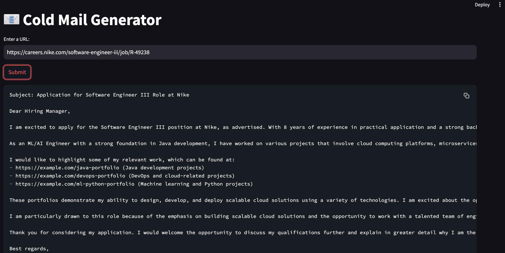

# 📧 Cold Mail Generator

Cold email generator for services company using groq, langchain and streamlit. It allows users to input the URL of a company's careers page, and their name and role. The tool then extracts job listings from that page and generates personalized cold emails. These emails include relevant portfolio links sourced from a vector database, based on the specific job descriptions.

**Imagine a scenario:**

-   Nike needs a Principal Software Engineer and is spending time and resources in the hiring process, on boarding, training etc
-   I am going to reach out to Nike via a cold email, since I believe that I have the relevant skills as required for this particular job at Nike.



## Architecture Diagram


## How to Run

### 1. Set up your Environment

**API Key:**

This project requires a Groq API key.

1.  Get your API key from [GroqCloud](https://console.groq.com/keys).
2.  Set the API key as an environment variable named `GROQ_API_KEY`. You can do this by:
    *   Creating a file named `.env` in the `app/` directory and adding the following line:
        ```
        GROQ_API_KEY="your_api_key_here"
        ```
    *   Or by setting it directly in your shell:
        ```bash
        export GROQ_API_KEY="your_api_key_here"
        ```

**Dependencies:**

Install the required Python packages using pip:

```commandline
pip install -r requirements.txt
```

### 2. Run the Application

Once your environment is set up, run the Streamlit application:

```commandline
streamlit run app/main.py
```

### 3. Use the Application

1.  Open the application in your browser.
2.  Fill in "Your Name" and "Your Role" to be used in the generated emails.
3.  Enter the URL of a job posting you are interested in.
4.  Click "Submit" and the generated email will be displayed on the screen.

## Deployment Considerations

*   **Selenium Webdriver:** This application uses `selenium` to scrape web pages. In some environments, you may need to install a webdriver (e.g., `chromedriver`) for `selenium` to function correctly.
*   **Vector Store:** The application uses a local ChromaDB vector store located in the `vectorstore/` directory. When deploying, ensure this directory is writable. The portfolio is loaded into the vector store the first time the application runs.
